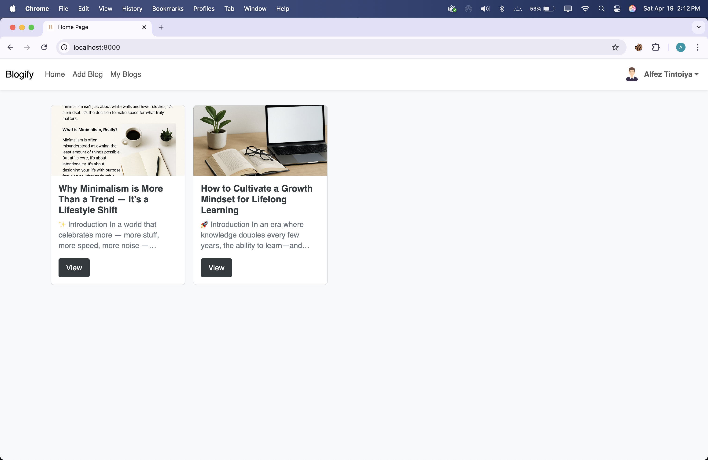

# Blogify-A-Blogging-Application

## Description

Blogify is a simple, user-friendly blogging platform that allows users to create, edit, delete, and view blog posts featuring a cover image, title, and rich content. It offers a clean, responsive interface that works seamlessly on desktop and mobile devices.

## 🚀 Features

✅ **Create Posts**: Upload a cover image, add a title, and write content using a simple rich-text editor.  
✅ **Edit & Delete**: Modify or remove your existing posts easily.  
✅ **View Posts**: Browse all posts in a list view or read a single post in detail.  
✅ **Responsive Design**: Mobile-first layout that adapts to any screen size.  
✅ **(Optional) Authentication**: Sign up, log in, and manage your own posts.  

## 🛠 Tech Stack

- **Frontend**: React.js (with Tailwind CSS or your preferred styling library)  
- **Backend**: Node.js & Express.js  
- **Database**: MongoDB (via Mongoose)  
- **File Storage**: MongoDB Atlas 
- **Authentication**: JWT (JSON Web Tokens) and cookies or local storage  

## 📸 Screenshots


## Prerequisites

- Node.js v14 or newer  
- npm
- MongoDB (local or hosted)  

## Installation

1. **Clone the repository**
   ```bash
   git clone https://github.com/alfeztintoiya/Blogify-A-Blogging-Application.git
   cd blogify
   ```

2. **Backend setup**
   ```bash
   cd backend
   npm install
   ```
   - Create a `.env` file in `backend/` with the following variables:
     ```env
     MONGO_URI=<your_mongodb_connection_string>
     PORT=3000
     ```
   ```bash
   npm run dev    # starts backend in development mode (e.g. with nodemon)
   ```


## Folder Structure

```
blogify/
|        # Express server and API
├── controllers/        # Route handlers
├── models/             # Mongoose schemas
├── routes/             # API routes
├── middleware/         # Auth, error handling, etc.
├── services/           # JWT Authentication
└── app.js           # App entry point
```

## Usage

1. Visit `http://localhost:3000` in your browser.  
2. (Optional) Register or log in to start creating posts.  
3. Click **New Post**, upload a cover image, add your title and content, then **Publish**.  
4. Browse published posts on the home page or click a post to view it in full.

## Scripts

From the project root:

- `npm run dev` (in `backend/`): Start Express server in development mode

## Contributing

Contributions are welcome! Please follow these steps:

1. Fork the repository.  
2. Create a new feature branch (`git checkout -b feature/YourFeature`).  
3. Commit your changes (`git commit -m 'Add YourFeature'`).  
4. Push to your branch (`git push origin feature/YourFeature`).  
5. Open a Pull Request.


##📧 Contact

Created by Alfez Tintoiya — feel free to reach out for feedback or questions!
<p>
  <a href="https://www.linkedin.com/in/alfez-tintoiya/" rel="nofollow noreferrer">
     LinkedIn
  </a> &nbsp; 
  <a href="https://github.com/alfeztintoiya" rel="nofollow noreferrer">
     Github
  </a>
</p>